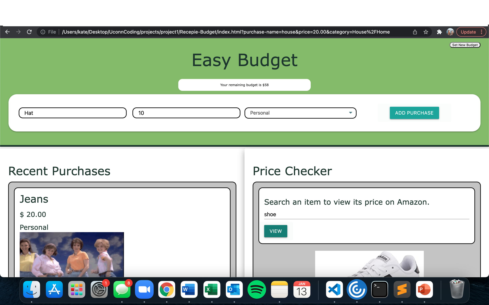

# Budget Application
This web application tracks user's budget via user updates of purchases. This applicationo incorperates HTML, CSS, (ADD CSS FRAMEWORK), JavaScript, Moment.js, and Web APIs. 

## USER STORY  
AS A person who has a limited amount of spendings available
I WANT to log my purchases
SO THAT I can see my remaining budget

## Project Aims 
* User types in a budget and will be logged. 
* The user will be able to fill out a form to update each purchase. This will include: the user's name, the item purchased, a comment on the item (with ability of including gifs), the price of the item, and the date it was purchased.
* This information will be added to a list that tracks the purchases made. 
* The application will automatically update the budget remaining after a purchase is inserted. 
* Purchase will be added to a calendar to view dates of purchases.
* The budget will be activated from the start date until present date. It can reset when the user presses "reset budget tracker". However, purchases will remain on the calendar. 

 
 

<a href="">Link to Website </a>
 
<a href="https://github.com/Jaswal1p/Recepie-Budget">Link to Repository </a>
 
<a href="">Link to Portfolio - Marika DiCarlo</a>
 
<a href="">Link to Portfolio - Bobby Jaswal</a>
 
<a href="https://kspitalnic.github.io/portfoliochallenge/">Link to Portfolio - Kate Spitalnic</a>
 
 

Screenshot:  
